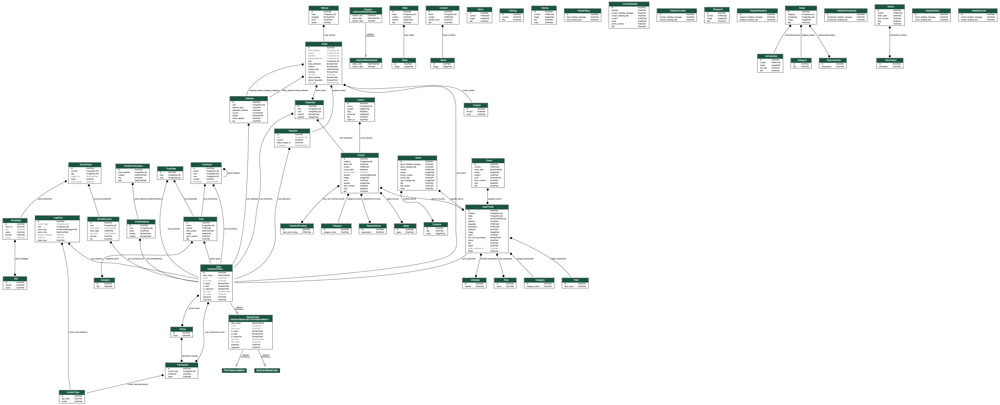

# Django EduCenter

- [EduCenter](http://demo.themefisher.com/educenter/) is an educational website template with affluent, contemporary, modern and trendy features for your majestic presence in web with a simple user interface. It’s a multipage website template consists the must-have features like home, about, courses, events, blogs and contacts that will add enormous value in your website and take it to a new height.

- However, you can use EduCenter as an online teaching platform, school and university websites without any complication as the appearance of the website is very user-friendly.

- EduCenter have store, so let's summarize each one:

1. USER - Built in Django user model,  insrtance created for each customer who registers.

2. CUSTOMER (UserProfile) - Along with a User model, each customer will contain a Customer model that holds a one to one relationship to each user. (OneToOneFied)

3. PRODUCT (Course) - The product model represents products we have in store.

4. ORDER - The order model will represent a transaction that is placed or pending. The model will hold information such as the transaction ID, data completed and order status. This model will be a child or the customer model but a parent to Order Items.

5. ORDERITEM - An order Item is one item with an order. For example, a shopping cart may consist of many items but is all part of one order. Therfore the OrderItem model will be a child of the PRODUCT model AND the ORDER Model.

6. SHIPPING - Not every order will need shipping information. For orders containing physical products that need to be shipping we will need to create an instance of the shipping model to know where to send the order. Shipping will simply be a child of the order model when necessary.

### DataBase model



## To run locally, do the usual:

### 1. Create a Python virtualenv

- Installing virtualenv
```sh
$ python3 -m pip install --user virtualenv
```

- Creating a virtual environment
```sh
$ virtualenv -p python3 venv
```

- Activating a virtual environment
```sh
$ source venv/bin/activate
```

### 2. Install dependencies:
```sh
$ pip install -r requirements/common.txt
```

### 3. Perform database migration:
1)
```sh
find . -path "*/migrations/*.py" -not -name "__init__.py" -delete
find . -path "*/migrations/*.pyc"  -delete
```

2) delete the `db.sqlite3`

3)
```sh
python manage.py makemigrations
python manage.py migrate
```

### 4. Create a superuser:
```sh
$ ./manage.py createsuperuser
```

### 5. Run Development Server
```sh
$ python manage.py runserver
```

## Generate data

### user and user profile
```sh
python manage.py create_users_data generate_data/names
```

### courses
```sh
$ python manage.py create_courses_data generate_data/titles
```

### posts
```sh
$ python manage.py create_posts_data generate_data/titles
```

## Advice

### GIT

- For new feature

```sh
$ git checkout -b feature
```

```sh
git branch

git checkout master
git pull origin master
git merge feature
git push origin master

git branch -d feature
```

### SECRET_KEY 

#### published

#### Load key from environment variable
- Instead of publishing your secret key, you can use an environment variable to set your secret key.

```py
from decouple import config

SECRET_KEY = config('SECRET_KEY')
```

#### Load secret key from file
- Alternatively, you can read the secret key from a file.
```py
from django.utils.crypto import get_random_string

chars = 'abcdefghijklmnopqrstuvwxyz0123456789!@#$%^&*(-_=+)'
new_key = get_random_string(50, chars)

with open("./secret_key.txt", "w+") as f:
    f.write(new_key)
    f.seek(0)
    SECRET_KEY = f.read().strip()

#or

with open('/etc/secret_key.txt') as f:
    SECRET_KEY = f.read().strip()
```


## More


### Renders a graphical overview of your project or specified apps

```sh
$ python manage.py graph_models -a -o edu.png
```

### A short Query Reminder

```sh
$ python manage.py shell

>>> from blog.models import Post
>>> from django.contrib.auth.models import User
>>> User.objects.all()
>>> User.objects.first()
>>> User.objects.filter(username='TestUser')
>>> User.objects.filter(username='TestUser').first()
>>> user = User.objects.filter(username='TestUser').first()
>>> user
>>> user.id
>>> user.pk
>>> user = User.objects.get(id=1)

>>> Post.objects.all()
>>> post_1 = Post(title='Blog 1', content='First post', author=user)
>>> Post.objects.all()
>>> post_1.save()
>>> Post.objects.all()

>>> User.objects.all()
>>> post.content
>>> post.date_posted

>>> user
>>> user.post_set.all()
>>> user.post_set.create(title='Blog 3', content='Thrid post')
>>> exit() 
```

### Save Requirements
```sh
$ pip3 freeze --local > requirements.txt
```

### Deployment

- Set the `STATIC_ROOT` setting to the directory from which you’d like to serve these files, for example:
```sh
$ STATIC_ROOT = "/var/www/example.com/static/"
```

- Run the `collectstatic` management command:
```sh
$ python manage.py collectstatic
```
This will copy all files from your static folders into the `STATIC_ROOT` directory.

- In root create `passenger_wsgi.py` and put
```py
from project_name.wsgi import application
```
--------------------------------------------------------------------
## django-heroku
- Minimal configuration to host a Django project at Heroku

### Create the project directory
```sh
$ mkdir directory_name
$ cd directory_name
```

### Create and activate your virtuanenv
```sh
$ virtualenv -p python3 .vEnv
$ . .vEnv/bin/activate
```

### Installing django
```sh
$ pip install django
```

### Create the django project
```sh
$ django-admin startproject myproject .
```

### Creating the Git repository
```sh
$ git init 
```
* Create a file called `.gitignore` with the following content:
```
# See the name for you IDE
.idea
# If you are using sqlite3
*.sqlite3
# Name of your virtuan env
.vEnv
*pyc
```
```sh
$ git add .
$ git commit -m 'First commit'
```
### Hidding instance configuration
```sh
$ pip install python-decouple
```
- create an `.env` file at the root path and insert the following variables
- `SECRET_KEY=Your$eCretKeyHere` (Get this secrety key from the `settings.py`)
- `DEBUG=True`

#### Settings.py
```py
from decouple import config

...

SECRET_KEY = config('SECRET_KEY')
DEBUG = config('DEBUG', default=False, cast=bool)
```

### Configuring the DataBase (You don't need that if you already had an database).
```sh
$ pip install dj-database-url
```

#### settings/production.py
```py
DATABASES = {
    'default': {
        'ENGINE': 'django.db.backends.sqlite3',
        'NAME': os.path.join(BASE_DIR, 'db.sqlite3'),
    }
}

db_from_env = dj_database_url.config()
DATABASES['default'].update(db_from_env)
DATABASES['default']['CONN_MAX_AGE'] = 500
```


### Static files 
```sh
$ pip install dj-static
```
#### wsgi (not mandatory)
```
from dj_static import Cling
application = Cling(get_wsgi_application())
```
* Also don't forget to check "DJANGO_SETTINGS_MODULE". It is prone to frequent mistakes.

#### settings.py
```py
STATICFILES_DIRS = [os.path.join(BASE_DIR, 'static_in_env')]

STATIC_ROOT = os.path.join(BASE_DIR, 'staticfiles')
STATIC_URL = '/static/'

MEDIA_ROOT = os.path.join(BASE_DIR, 'media')
MEDIA_URL = '/media/'
```

### Create a requirements-dev.txt
```sh
$ pip freeze > requirements-dev.txt
```

### Create a file `requirements.txt` file and include reference to previows file and add two more requirements
```
-r requirements-dev.txt
gunicorn
psycopg2
```
### Create a file `Procfile` and add the following code

```
web: gunicorn edu.wsgi --log-file -
```

* You can check in django website or heroku website for more information:
https://docs.djangoproject.com/en/2.2/howto/deployment/wsgi/gunicorn/
https://devcenter.heroku.com/articles/django-app-configuration

### Create a file runtime.txt and add the following core (not mandatory)
* python-3.6.0 (You can currently use "python-3.7.3")

### Creating the app at Heroku
- You should install heroku CLI tools in your computer previously ( See https://devcenter.heroku.com/articles/heroku-cli )
- For macOS
```sh
$ brew tap heroku/brew && brew install heroku
```
- You can also login in heroku by: `heroku login` and create app
```sh
$ heroku login
$ heroku create your_app_name --region eu
```

### Setting the allowed hosts
* include your address at the `ALLOWED_HOSTS` directives in settings.py - Just the domain, make sure that you will take the protocol and slashes from the string

### Heroku install config plugin
```sh
$ heroku plugins:install heroku-config
$ heroku plugins:install heroku-fork
```

#### Sending configs from .env to Heroku ( You have to be inside tha folther where .env files is)
```sh
$ heroku plugins:install heroku-config
$ heroku config:push -a
$ heroku ps:scale web=1
```

#### Install the Whitenoise and `django_heroku` , and don’t forget to update the requirements.txt:
```sh
$ pip install whitenoise
$ pip install psycopg2==2.7.5
$ pip install psycopg2-binary==2.8.5
$ pip install django_heroku
```
- Update the settings.py

```py
import django_heroku

...

STATICFILES_STORAGE = 'whitenoise.django.GzipManifestStaticFilesStorage'

...

django_heroku.settings(locals())
```


#### To show heroku configs do
```sh
$ heroku config
```
(check this, if you fail changing by code, try changing by heroku dashboard)

### Publishing the app
```sh
$ git add .
$ git commit -m 'Configuring the app'
$ git push heroku master --force (you don't need "--force")
```

Output:
```sh
mt at Milovans-MacBook-Pro in edu-master on master
$ git push heroku master
Enumerating objects: 17, done.
Counting objects: 100% (17/17), done.
Delta compression using up to 4 threads
Compressing objects: 100% (9/9), done.
Writing objects: 100% (9/9), 755 bytes | 125.00 KiB/s, done.
Total 9 (delta 8), reused 0 (delta 0)
remote: Compressing source files... done.
remote: Building source:
remote:
remote: -----> Python app detected
remote: -----> No change in requirements detected, installing from cache
remote: -----> Installing SQLite3
remote: -----> Installing requirements with pip
remote: -----> Discovering process types
remote:        Procfile declares types -> web
remote:
remote: -----> Compressing...
remote:        Done: 110.8M
remote: -----> Launching...
remote:        Released v61
remote:        https://mtedu.herokuapp.com/ deployed to Heroku
remote:
remote: Verifying deploy... done.
To https://git.heroku.com/mtedu.git
   1d360b4..b23c94a  master -> master
```

### Creating the data base (if you are using your own data base you don't need it, if was migrated there)
```sh
$ heroku addons:create heroku-postgresql:hobby-dev --app your_app_name
$ heroku run python manage.py migrate
```

### And there you go! Try the URL in a web browser: https://mtedu.herokuapp.com or `heroku open`
```sh
$ heroku open
```

### Creating the Django admin user
```sh
$ heroku run python manage.py createsuperuser
```
* (the same as above)

### EXTRAS
#### You may need to disable the collectstatic
```sh
$ heroku config:set DISABLE_COLLECTSTATIC=1
```

#### Also recommend set this configuration to your heroku settings
```sh
$ WEB_CONCURRENCY = 3
```

#### Changing a specific configuration
```sh
$ heroku config:set DEBUG=True
```

--------------------------------------------------------------------

### References/Recommendation to read

- [GIT - CoreyMSchafer](https://github.com/CoreyMSchafer/code_snippets/tree/master/Django_Blog)
- [Stories about Python, Django and Web Development](https://simpleisbetterthancomplex.com)
- [GIT - Blog about Python, Django and Web development](https://github.com/sibtc)
- [Add inline model to django admin site](https://stackoverflow.com/questions/33748059/add-inline-model-to-django-admin-site)
- [Run the test suite](https://github.com/django/django/tree/master/tests)
- [Django's ManyToMany Relationship with Additional Fields](https://stackoverflow.com/questions/4443190/djangos-manytomany-relationship-with-additional-fields)
- [Extra fields on many-to-many relationships](https://docs.djangoproject.com/en/2.1/topics/db/models/#extra-fields-on-many-to-many-relationships)
- [How to fetch the top two products for each product type?](https://stackoverflow.com/questions/1357478/how-to-fetch-the-top-two-products-for-each-product-type?rq=1)
- [How to display a query set in the django admin?](https://stackoverflow.com/questions/17204640/how-to-display-a-query-set-in-the-django-admin)
- [JustDjango](https://github.com/justdjango)
- [Django Admin filter on Foreign Key property](https://stackoverflow.com/questions/2379702/django-admin-filter-on-foreign-key-property)
- [Creating Custom Filters for list_filter in Django Admin](https://stackoverflow.com/questions/12102697/creating-custom-filters-for-list-filter-in-django-admin)
- [filter foreignkey field in django admin](https://stackoverflow.com/questions/10179129/filter-foreignkey-field-in-django-admin)
- [How to add multiple objects to ManyToMany relationship at once in Django ?](https://stackoverflow.com/questions/4959499/how-to-add-multiple-objects-to-manytomany-relationship-at-once-in-django)
- [ManyRelatedManager](https://stackoverflow.com/questions/8095813/attributeerror-manyrelatedmanager-object-has-no-attribute-add-i-do-like-in)
- [Using Django's m2m_changed to modify what is being saved pre_add](https://stackoverflow.com/questions/26493254/using-djangos-m2m-changed-to-modify-what-is-being-saved-pre-add)
- [How to create an object for a Django model with a many to many field?](https://stackoverflow.com/questions/6996176/how-to-create-an-object-for-a-django-model-with-a-many-to-many-field)
- [An example of using many-to-many "through" to augment m2m relationships](https://gist.github.com/jacobian/827937)
- [How to express a One-To-Many relationship in Django](https://stackoverflow.com/questions/6928692/how-to-express-a-one-to-many-relationship-in-django)
- [Search Engine Optimisation (SEO) for Django sites](https://djangopackages.org/grids/g/seo/)
- [Django ManyToMany filter()](https://stackoverflow.com/questions/2218327/django-manytomany-filter)
- [Create a card token](https://stripe.com/docs/api/tokens/create_card)
- [Change slug in django use slugify](https://stackoverflow.com/questions/29293096/change-slug-in-django-use-slugify)
- [How to create a unique slug in Django](https://stackoverflow.com/questions/3816307/how-to-create-a-unique-slug-in-django)
- [Django Unique Slug by id](https://stackoverflow.com/questions/11978035/django-unique-slug-by-id)
- [Django post_save() signal implementation](https://stackoverflow.com/questions/13014411/django-post-save-signal-implementation)
- [Django Projects](https://www.codingforentrepreneurs.com)
- [Django & Chart js integration ](https://pyplane.com/blog/how-to-create-charts-in-django-with-chart-js/)
- [Learn how to integrate Chart.js with Django](https://github.com/codingforentrepreneurs/Django-Chart.js)
- [eCommerce](https://github.com/codingforentrepreneurs/eCommerce)
- [Examples of model relationship API usage](https://docs.djangoproject.com/en/3.0/topics/db/examples/)
- [Themify icons](http://thetheme.io/theadmin/content/icons-themify.html)
